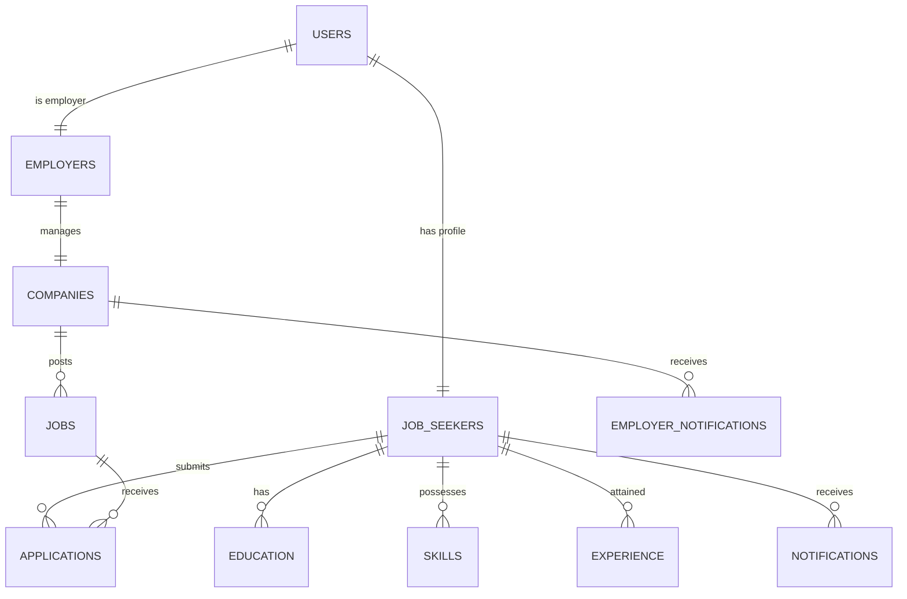
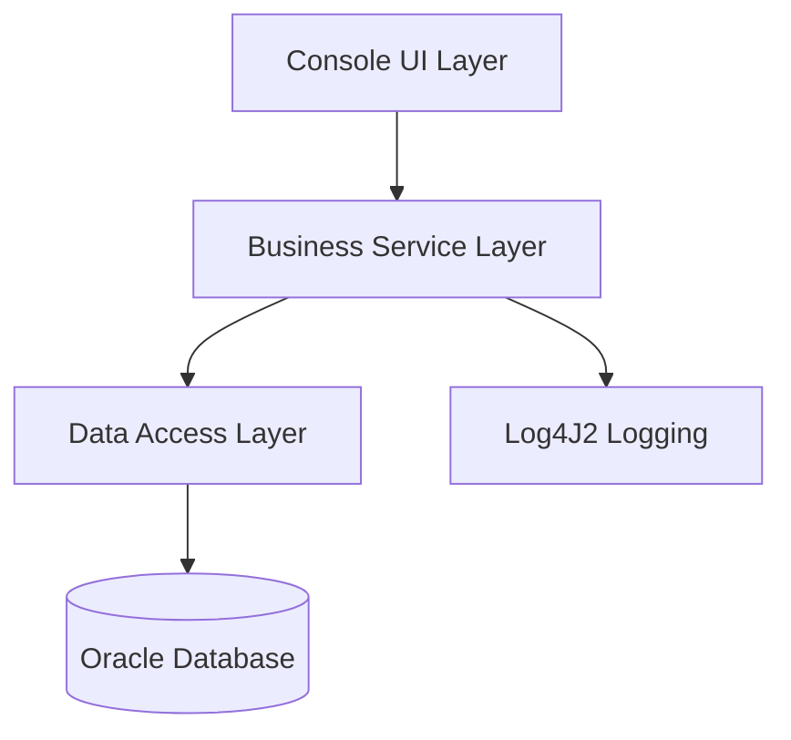

# RevHire Application Documentation

## 1. Entity Relationship Diagram (ERD)

### Table Details:
- **USERS**: `user_id`, `email`, `password_hash`, `role`, `security_question`, `security_answer`
- **JOBS**: `job_id`, `company_id`, `job_title`, `job_description`, `skills_required`, `education_required`, `salary_range`
- **APPLICATIONS**: `application_id`, `job_id`, `job_seeker_id`, `status`, `applied_date`, `comments`

---

## 2. Application Architecture

### Architecture Breakdown:
- **Presentation (com.revhire.ui)**: Handles input/output.
- **Service (com.revhire.service)**: Contains business logic and orchestrates data.
- **DAO (com.revhire.dao)**: Performs CRUD operations using JDBC.

---

## 3. Technologies Used
- **Language**: Java 8+
- **Database**: Oracle (SQL Developer)
- **Framework**: JDBC (No ORM used for performance)
- **Build Tool**: Maven
- **Logging**: Log4J2
- **Testing**: JUnit 5
- **Version Control**: Git

---

## 4. Roles & Responsibilities

As the Lead Developer of the RevHire Project, the following responsibilities were undertaken:

### **Architectural Design**
- Designed the **3-Tier Architecture** (Presentation, Service, DAO) to ensure clean separation of concerns and maintainability.
- Designed and implemented the **Relational Database Schema** (ERD) using Oracle SQL, including complex relationships between 12+ tables.

### **Full-Stack Development**
- Developed a robust **Console-based User Interface** with dynamic menus and real-time profile completion feedback.
- Implemented core **Authorization & Security** logic, including password resets and role-based access control.
- Engineered a **Job-to-Seeker Matching Algorithm** that connects candidates with opportunities based on multi-factor analysis (Skills, Education).

### **System Integration & Communication**
- Developed an **In-App Notification System** with real-time alerts for application status changes and new job postings.
- Integrated **Log4J2** for structured system auditing and error tracking.
- Managed **Resource Optimization** by implementing a custom `ScannerUtil` to prevent memory leaks and improve input handling.

### **Quality Assurance & DevOps**
- Authored a comprehensive suite of **Unit Tests** using **JUnit 5** and **Mockito** to verify business logic isolation.
- Managed project dependency and lifecycle automation using **Maven**.
- Utilized **Git** for version control, ensuring a clean and documented commit history.
- Performed **Code Refactoring** to ensure compliance with Java 17 standards and professional coding practices.
