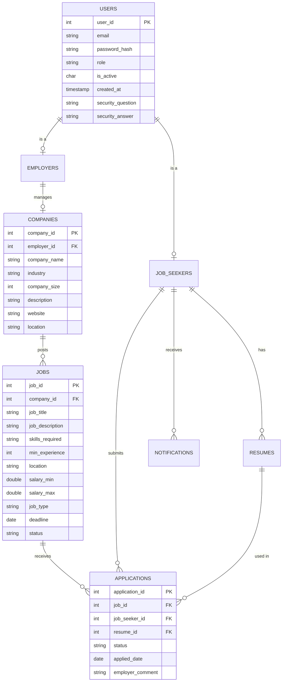

# RevHire - Job Portal Application

RevHire is a console-based job portal application that connects job seekers with employers.

## Core Features

### For Job Seekers
- **Authentication**: Register, Login, Forgot Password (Security Questions).
- **Profile Management**: Manage Education, Experience, Skills, and Certifications.
- **Resume Management**: Create and manage textual resumes.
- **Job Search**: Search jobs with multiple filters (role, location, experience, etc.).
- **Applications**: One-click apply using saved resume, view application status, and withdraw applications.
- **Notifications**: In-app notifications for status updates.

### For Employers
- **Company Management**: Register company and manage company profile.
- **Job Management**: Post new jobs, edit existing postings, close/reopen or delete jobs.
- **Applicant Management**: View applicants for each job, shortlist or reject applications with comments.
- **Search**: Search/Filter applicants.

---

## Entity Relationship Diagram (ERD)

---

## Application Architecture

The application follows a standard **layered architecture**:

1.  **Presentation Layer (UI)**:
    -   Located in `com.revhire.ui`.
    -   Handles user input/output via console.
    -   Calls service layer methods.

2.  **Service Layer (Business Logic)**:
    -   Located in `com.revhire.service`.
    -   Contains interfaces and implementations.
    -   Handles business rules and coordinates between DAOs.

3.  **Data Access Layer (DAO)**:
    -   Located in `com.revhire.dao`.
    -   Contains interfaces and JDBC-based implementations.
    -   Handles all database interactions.

4.  **Model Layer**:
    -   Located in `com.revhire.model`.
    -   Contains Plain Old Java Objects (POJOs) representing database entities.

5.  **Configuration**:
    -   `com.revhire.config.DBConnection` handles database connectivity.
