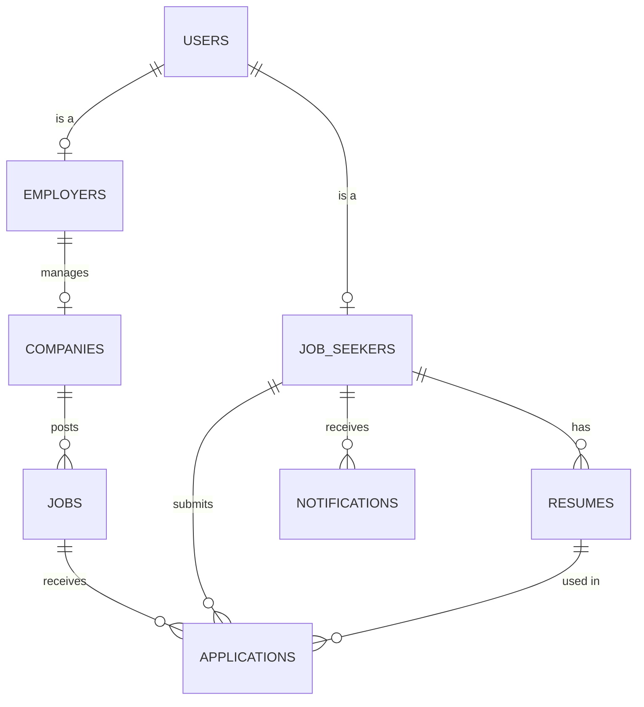

# RevHire - Job Portal Application

RevHire is a robust, console-based job portal application designed to bridge the gap between talented job seekers and leading employers. Built with a clean 3-tier architecture, it provides a seamless experience for managing job postings, profile building, and the recruitment process.

---

## 🚀 Key Features

### 👤 For Job Seekers
- **Authentication**: Secure registration and login with password recovery using security questions.
- **Profile Management**: Build a comprehensive professional profile including Education, Experience, Skills, and Certifications.
- **Resume Management**: Create and maintain detailed resumes.
- **Job Search**: Advanced filtering system to find jobs by title, location, experience, and salary.
- **One-Click Apply**: Easily apply to jobs using saved profiles and track application status in real-time.
- **Notifications**: Stay updated with in-app alerts for application status changes.

### 🏢 For Employers
- **Organization Management**: Register and manage company profiles and industry details.
- **Job Lifecycle**: Full control over job postings—create, edit, close, or reopen listings.
- **Applicant Tracking**: View detailed applicant profiles, shortlist candidates, or reject with feedback.
- **Applicant Search**: Filter through applicants to find the perfect fit for specific roles.

---

## 🏗️ Architecture & Design

### Entity Relationship Diagram (ERD)
The application manages complex relationships between users, companies, jobs, and applications.



### 3-Tier Layered Architecture
RevHire follows a strictly decoupled architecture to ensure maintainability and scalability:

1.  **Presentation Layer (`com.revhire.ui`)**: Interactive console UI handling user I/O.
2.  **Service Layer (`com.revhire.service`)**: Business logic, validation, and orchestration.
3.  **Data Access Layer (`com.revhire.dao`)**: Direct interaction with Oracle DB using optimized JDBC queries.
4.  **Model Layer (`com.revhire.model`)**: POJO representations of business entities.

---

## 🛠️ Technology Stack

- **Core**: Java 17
- **Database**: Oracle Database
- **Persistence**: Optimized JDBC (No ORM for peak performance)
- **Build Tool**: Maven
- **Logging**: Log4j 2 (Structured auditing and error tracking)
- **Testing**: JUnit 5 & Mockito

---

## 📦 Getting Started

### Prerequisites
- **Java JDK 17** or higher
- **Maven 3.x**
- **Oracle Database** instance

### Database Setup
1. Configure your database credentials in `com.revhire.config.DBConnection`.
2. Run the provided SQL scripts (if available) to initialize the 12+ required tables.

### Installation
```bash
# Clone the repository
git clone <repository-url>

# Navigate to project directory
cd RevHire

# Build the project
mvn clean install
```

### Running the Application
```bash
# Run the main application
mvn exec:java -Dexec.mainClass="com.revhire.ui.MainMenu"
```

---

## 🧪 Testing & Quality Assurance
The project includes a suite of unit tests to ensure business logic reliability.

```bash
# Run all tests
mvn test
```
Tests utilize **Mockito** for mocking DAOs and services, ensuring isolation and fast execution.

---

## 📝 Logging
Systems logs and audits are maintained in:
- **Console Output**: Real-time operational feedback.
- **File Log**: Detailed logs at `logs/revhire.log`.

Configuration is managed via `src/main/resources/log4j2.xml`.

---

## 👨‍💻 Author
**Lead Developer** - RevHire Team
